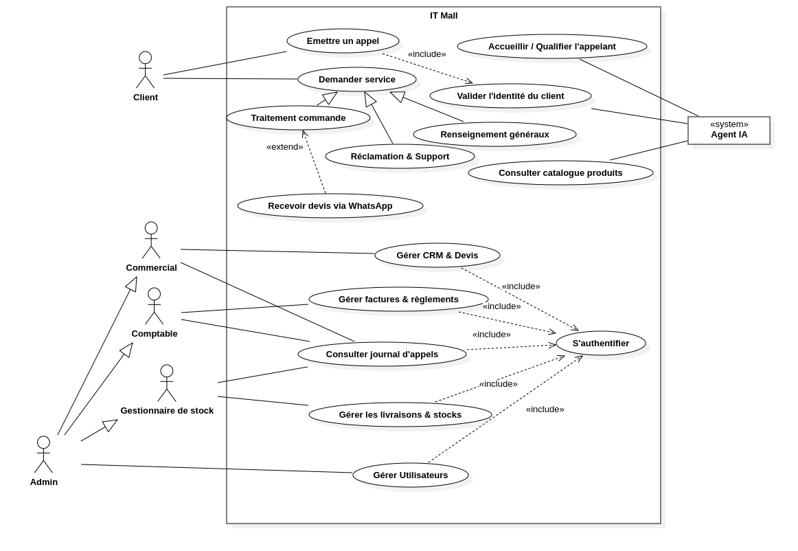

# 🛒 IT Mall – Enterprise Voice AI & ERP Automation Suite

An end-to-end distributed system bridging **Real-Time Conversational AI Telephony (VoIP/SIP)**, **Enterprise Resource Planning (Odoo 18)**, and **Event-Driven Post-Call Automation (n8n & Meta WhatsApp Cloud API)**.

---

## 🌟 Key Highlights & Features

- 🎙️ **Real-Time Voice AI Agent**: Zero-latency voice interaction via Asterisk AudioSocket, Groq / Gemini LLM streaming, Silero VAD, and local neural TTS (Piper).
- 📦 **Dynamic Real-Time Catalog Injection**: Zero hardcoding — the voice agent queries PostgreSQL in real time to fetch exact products, live stock availability, and prices.
- 🏢 **Custom Odoo 18 ERP**: 
  - Tailored Dark UI / UX (`it_mall_branding`).
  - Comprehensive Call Log (`it_mall.call.log`) with integrated HTML5 audio player and dynamic status tracking.
  - Multi-Department Role-Based Access Control (RBAC) separating Commercials, Accountants, Stock Managers, and Admins.
- ⚡ **Automated Post-Call Pipeline (n8n)**:
  - Intent classification (`quote_request`, `complaint`, `general_inquiry`, `cancellation`).
  - Automatic creation of CRM Leads and Sales Orders in Odoo.
- 📄 **Dynamic Quote Rendering & Instant Delivery**:
  - Headless QWeb PDF rendering service (`agent.pdf_service` on port `:8301`).
  - Automated dispatch of official branded PDF quotes directly to the caller's verified WhatsApp via Meta Cloud API.

---

## 🏛️ System Architecture

```
                       ┌──────────────────────┐
                       │   Caller / Client    │
                       └──────────┬───────────┘
                                  │ (SIP / VoIP Call)
                                  ▼
                       ┌──────────────────────┐
                       │  Asterisk / FreePBX  │
                       └──────────┬───────────┘
                                  │ (AudioSocket TCP :8300)
                                  ▼
 ┌─────────────────────────────────────────────────────────────────┐
 │                   Python Voice Agent (FastAGI)                  │
 │  - Silero VAD (Voice Activity Detection)                        │
 │  - Groq (Whisper-large-v3) & LLM Streaming (Gemini / Groq)      │
 │  - Piper Neural TTS (Ultra-low latency audio generation)        │
 │  - Live PostgreSQL Real-time Catalog Lookup                     │
 └──────────────────────┬──────────────────────────────────────────┘
                        │
                        ├──────────────────────────┐
                        │ (Post-call Webhook JSON) │ (Call Log + Audio .wav)
                        ▼                          ▼
 ┌──────────────────────────────┐        ┌─────────────────────────┐
 │     n8n Workflow Engine      │        │      Odoo 18 ERP        │
 │  - Intent Routing            │        │  - it_mall_branding     │
 │  - Partner & CRM Management  │───────►│  - it_mall.call.log     │
 │  - Sale Order Creation       │        │  - RBAC Security Rules  │
 └──────────────┬───────────────┘        └────────────┬────────────┘
                │                                     │
                │ (HTTP Trigger :8301)                │ (QWeb Report)
                ▼                                     ▼
 ┌─────────────────────────────────────────────────────────────────┐
 │             PDF Service & Meta WhatsApp Cloud API               │
 │  - Generates Official QWeb Sale Order PDF                       │
 │  - Dispatches Media Message to Caller's WhatsApp               │
 └─────────────────────────────────────────────────────────────────┘
```

---

## 📖 Documentation & Setup

For a full step-by-step setup guide from scratch, see [INSTALL.md](INSTALL.md).

---

## 📁 Repository Structure

```text
.
├── voice-agent/            # Python Voice Agent core (AudioSocket, LLM, VAD, TTS, PDF Service)
│   ├── agent/              # Modular backend architecture
│   ├── db/                 # SQLite local persistence & schemas
│   ├── ai_agent.agi        # Asterisk AGI script
│   └── db.env.example      # Environment variables template
│
├── odoo-addons/            # Custom Odoo 18 modules
│   └── it_mall_branding/   # Views, SCSS dark theme, Call Log model, RBAC rules, QWeb reports
│
├── telephony/              # Telephony / VoIP configuration
│   └── extensions_custom.conf # Asterisk dialplan routing calls to AudioSocket
│
├── n8n-workflows/          # n8n Automation workflows
│   └── it_mall_post_call.json # End-to-end post-call orchestration workflow
│
└── docs/                   # UML & Architecture diagrams
    └── use_case_diagram.png # Comprehensive UML Use Case diagram
```

---

## 📐 UML Use Case Diagram



---

## 🛠️ Tech Stack

- **AI & Voice**: Python 3.12, Asterisk AudioSocket, Silero VAD, Groq API, Google Gemini, Piper TTS.
- **Backend & ERP**: Odoo 18, PostgreSQL, Python XML-RPC.
- **Integration & Automation**: n8n, Meta WhatsApp Business Cloud API, Docker.
- **Frontend / Styling**: QWeb, XML, SCSS, JavaScript.

---

## 🔒 Security & Best Practices

- Strict **Role-Based Access Control (RBAC)** implemented at the ORM level in Odoo.
- Sensitive environment credentials stored in `.env` (excluded via `.gitignore`).
- Modular microservice architecture allowing independent scaling of VoIP, AI, and ERP components.
